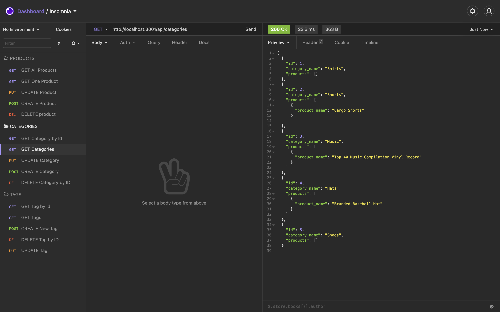

# hw13-e-commerce-back-end

# 📝🔖 Description 📝🔖

Internet retail, also known as **e-commerce**, is the largest sector of the electronics industry, generating an estimated $29 trillion in 2019. E-commerce platforms like Shopify and WooCommerce provide a suite of services to businesses of all sizes. Due to their prevalence, understanding the fundamental architecture of these platforms will benefit you as a full-stack web developer.

# 🔗 Link

- [Github-e-commerce-back-end](https://thuluong249.github.io/hw13-e-commerce-back-end/)

# 📄 Installation Instruction.

You will need to install all the packages using npm, beside that you will need to installation of MySql with Workbench to work with this application. Beside that you need to run the seed, npm run seed and npm start or node server.js to run the localhost in Insomnia.

- [Node.js](https://nodejs.org/en/)
- [npm](https://www.npmjs.com/)
- [Inquirer]()
- [MySql](https://www.mysql.com/)

# 📸 Screenshot 📸

---

---

# 🙈 Test

To test this application, open a command line prompt and run node server.js or npm start.

[Video](https://drive.google.com/file/d/15hh8obwCsvBvrgbzKhvO7b3e8ZU9W0zJ/view)
--- 

# Questions

If you have any questions, here is a link to my github as well as my email address. Feel free to contanct me!

* [Github](https://github.com/thuluong249)

* <a href="mailto:thujtn2019@gmmail.com">💌 Email</a> 

